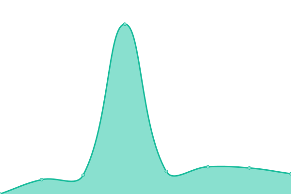

# [📈 Live Status](https://status.kamero.in): <!--live status--> **🟧 Partial outage**

This repository contains the open-source uptime monitor and status page for [kamero-in](https://status.kamero.in), powered by [Upptime](https://github.com/upptime/upptime).

With [Upptime](https://upptime.js.org), you can get your own unlimited and free uptime monitor and status page, powered entirely by a GitHub repository. We use [Issues](https://github.com/kamero-in/upptime/issues) as incident reports, [Actions](https://github.com/kamero-in/upptime/actions) as uptime monitors, and [Pages](https://status.kamero.in) for the status page.

<!--start: status pages-->
<!-- This summary is generated by Upptime (https://github.com/upptime/upptime) -->
<!-- Do not edit this manually, your changes will be overwritten -->
<!-- prettier-ignore -->
| URL | Status | History | Response Time | Uptime |
| --- | ------ | ------- | ------------- | ------ |
|  [Kamero.in Website](https://kamero.in) | 🟩 Up | [kamero-in-website.yml](https://github.com/Hitesh-Kamero/kamero-upptime/commits/HEAD/history/kamero-in-website.yml) | 

 1319ms
     
 | 

<a href="https://status.kamero.in/history/kamero-in-website">100.00%</a>
    

|  [Kamero.in Admin](https://login.kamero.in) | 🟩 Up | [kamero-in-admin.yml](https://github.com/Hitesh-Kamero/kamero-upptime/commits/HEAD/history/kamero-in-admin.yml) | 

 1392ms
     
 | 

<a href="https://status.kamero.in/history/kamero-in-admin">100.00%</a>
    

|  [Weblink Project](https://kamero.in/anmolkriti) | 🟩 Up | [weblink-project.yml](https://github.com/Hitesh-Kamero/kamero-upptime/commits/HEAD/history/weblink-project.yml) | 

 1188ms
     
 | 

<a href="https://status.kamero.in/history/weblink-project">100.00%</a>
    

|  [API v2](https://apiv2.kamero.in/v1/check_app_v2) | 🟩 Up | [api-v2.yml](https://github.com/Hitesh-Kamero/kamero-upptime/commits/HEAD/history/api-v2.yml) | 

 912ms
     
 | 

<a href="https://status.kamero.in/history/api-v2">100.00%</a>
    

|  [Renewal Link](https://event.kamero.in/renew/anmolkriti) | 🟩 Up | [renewal-link.yml](https://github.com/Hitesh-Kamero/kamero-upptime/commits/HEAD/history/renewal-link.yml) | 

 633ms
     
 | 

<a href="https://status.kamero.in/history/renewal-link">100.00%</a>
    

|  [V1 API](https://goapi.kamero.in/v1/event_home_viewer?eventCode=anmolkriti&skip=0&limit=0) | 🟥 Down | [v1-api.yml](https://github.com/Hitesh-Kamero/kamero-upptime/commits/HEAD/history/v1-api.yml) | 

 469ms
     
 | 

<a href="https://status.kamero.in/history/v1-api">0.00%</a>
    

<!--end: status pages-->

[**Visit our status website →**](https://status.kamero.in)

## 📄 License

- Powered by: [Upptime](https://github.com/upptime/upptime)
- Code: [MIT](./LICENSE) © [Anand Chowdhary](https://anandchowdhary.com), supported by [Pabio](https://pabio.com)
- Data in the `./history` directory: [Open Database License](https://opendatacommons.org/licenses/odbl/1-0/)
